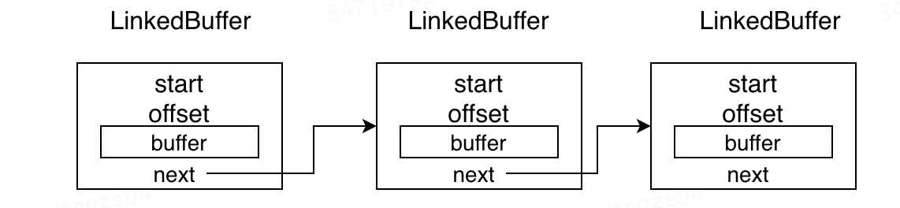
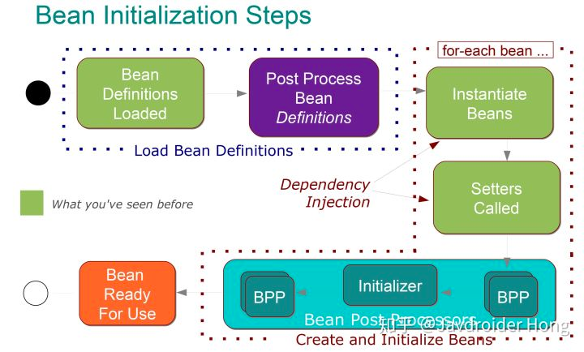
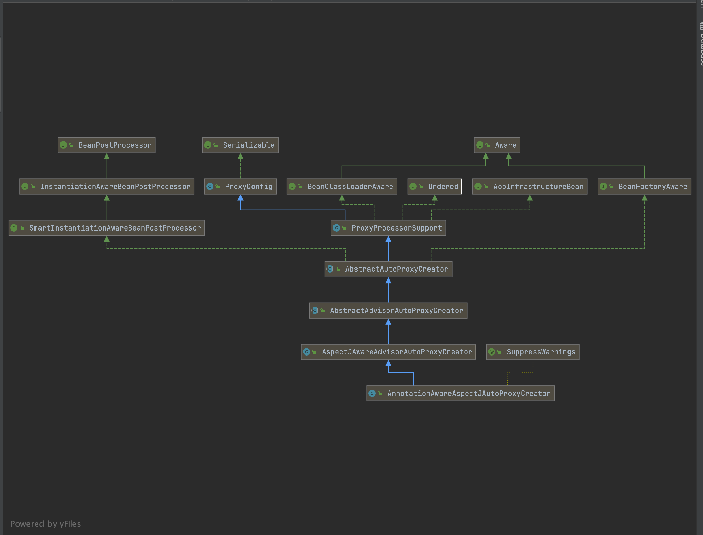

# 奇怪的bug 以及解决方法

[debug与run的日志不同](https://blog.csdn.net/lkforce/article/details/90479650)
原因是 idea debug时私自调用toString 方法 。

[HashMap线程不安全](https://cloud.tencent.com/developer/article/1797928)
不能用HashMap存储TimeLine

[mapstruct与lombok](https://stackoverflow.com/questions/63034956/mapstruct-no-property-named-packaging-exists-in-source-parameters)

# SPI机制

SPI 实际上是“基于接口的编程＋策略模式＋配置文件”组合实现的动态加载机制

系统设计的各个抽象，往往有很多不同的实现方案， 在面向的对象的设计里，一般推荐模块之间基于接口编程，模块之间不对实现类进行硬编码。 一旦代码里涉及具体的实现类，就违反了可拔插的原则，如果需要替换一种实现，就需要修改代码。
为了实现在模块装配的时候能不在程序里动态指明，这就需要一种服务发现机制。

### 使用场景

适用于：调用者根据实际使用需要，启用、扩展、或者替换框架的实现策略

比较常见的例子：

+ 数据库驱动加载接口实现类的加载 JDBC加载不同类型数据库的驱动

+ 日志门面接口实现类加载 SLF4J加载不同提供商的日志实现类

+ Spring Spring中大量使用了SPI,比如：对servlet3.0规范对ServletContainerInitializer的实现、自动类型转换Type Conversion SPI(Converter
  SPI、Formatter SPI)等

+ Dubbo Dubbo中也大量使用SPI的方式实现框架的扩展, 不过它对Java提供的原生SPI做了封装，允许用户扩展实现Filter接口

### 使用介绍

要使用Java SPI，需要遵循如下约定：

1. 当服务提供者提供了接口的一种具体实现后，在jar包的META-INF/services目录下创建一个以“接口全限定名”为命名的文件，内容为实现类的全限定名；
2. 接口实现类所在的jar包放在主程序的classpath中；
3. 主程序通过java.util.ServiceLoder动态装载实现模块，它通过扫描META-INF/services目录下的配置文件找到实现类的全限定名，把类加载到JVM；
4. SPI的实现类必须携带一个不带参数的构造方法；

# 序列化

## 1. ProtoBuffer

### 序列化过程中的数据存储- LinkedBuffer

LinkedBuffer是用于存储序列化过程中字节数组的数据结构。 由于在序列化之前，并不知道需要分配多大的连续内存空间， 因此Protostuff设计了LinkedBuffer这种数据结构，
通过将不连续内存组成一个链表的形式，使得能够在执行序列化过程中，动态的扩张。

### 编码格式

Protostuff采用了T-L-V的存储格式存储数据， 其中的T代表tag，即是key，L是length，代表当前存储的类型的数据长度， 当是数值类型（i32,i63等）的时候L被忽略，V代表value，即存入的值，
Protostuff会将每一个key根据不同的类型对应的序列化算法进行序列化， 然后按照key-length-value key-length-value的格式存储，

## 2. Kryo

# Spring

## Spring 的类扫描器分析 - ClassPathBeanDefinitionScanner

https://www.jianshu.com/p/d5ffdccc4f5d

## BeanPostProcessor

连接Spring IOC和AOP的桥梁

[BeanPostProcessor 连接Spring IOC和AOP的桥梁](https://zhuanlan.zhihu.com/p/38208324)

[代码](https://github.com/hzy38324/Spring-Boot-Practice)

~~~java
public interface BeanPostProcessor {
    //bean初始化方法调用前被调用
    Object postProcessBeforeInitialization(Object bean, String beanName) throws BeansException;
    //bean初始化方法调用后被调用
    Object postProcessAfterInitialization(Object bean, String beanName) throws BeansException;

}
~~~

调用顺序如下：

1. Spring IOC容器实例化Bean
2. 调用BeanPostProcessor的postProcessBeforeInitialization方法
3. 调用bean实例的初始化方法
4. 调用BeanPostProcessor的postProcessAfterInitialization方法
   

当需要动态代理时，最终放入Spring容器当是代理对象，而不是原对象。 在postProcessBeforeInitialization或者postProcessAfterInitialization方法中，
对对象进行判断，看他需不需要织入切面逻辑， 如果需要，那我就根据这个对象，生成一个代理对象，然后返回这个代理对象，那么最终注入容器的，自然就是代理对象了。 这个服务于Spring AOP 的
BeanPostProcessor，叫做AnnotationAwareAspectJAutoProxyCreator.

[spring-aop-vs-aspectj](https://www.baeldung.com/spring-aop-vs-aspectj)

## @import

[使用@Import注解给容器中快速导入一个组件](https://mp.weixin.qq.com/s?__biz=Mzg4MjU0OTM1OA==&mid=2247489303&idx=1&sn=b5292f66835dd95ca43eebd76201f935&source=41#wechat_redirect)

### 注册bean的方式

向Spring容器中注册bean通常有以下几种方式：

1. 包扫描+标注注解（@Controller、@Servcie、@Repository、@Component），通常用于自己写的类。

2. @Bean注解，通常用于导入第三方包中的组件。

3. @Import注解，快速向Spring容器中导入组件。

~~~java

/**
 * Indicates one or more <em>component classes</em> to import &mdash; typically
 * {@link Configuration @Configuration} classes.
 *
 * 
Provides functionality equivalent to the {@code <import/>} element in Spring XML.
 * Allows for importing {@code @Configuration} classes, {@link ImportSelector} and
 * {@link ImportBeanDefinitionRegistrar} implementations, as well as regular component
 * classes (as of 4.2; analogous to {@link AnnotationConfigApplicationContext#register}).
 *
 * 
{@code @Bean} definitions declared in imported {@code @Configuration} classes should be
 * accessed by using {@link org.springframework.beans.factory.annotation.Autowired @Autowired}
 * injection. Either the bean itself can be autowired, or the configuration class instance
 * declaring the bean can be autowired. The latter approach allows for explicit, IDE-friendly
 * navigation between {@code @Configuration} class methods.
 *
 * 
May be declared at the class level or as a meta-annotation.
 *
 * 
If XML or other non-{@code @Configuration} bean definition resources need to be
 * imported, use the {@link ImportResource @ImportResource} annotation instead.
 *
 * @author Chris Beams
 * @author Juergen Hoeller
 * @since 3.0
 * @see Configuration
 * @see ImportSelector
 * @see ImportBeanDefinitionRegistrar
 * @see ImportResource
 */
@Target(ElementType.TYPE)
@Retention(RetentionPolicy.RUNTIME)
@Documented
public @interface Import {

	/**
	 * {@link Configuration @Configuration}, {@link ImportSelector},
	 * {@link ImportBeanDefinitionRegistrar}, or regular component classes to import.
	 */
	Class<?>[] value();

}
~~~

@Import可以配合 Configuration ,ImportSelector, ImportBeanDefinitionRegistrar 来使用，下面的or表示也可以把Import当成普通的Bean使用。

@Import只允许放到类上面，不能放到方法上。

### @Import注解的使用方式

@Import注解的三种用法主要包括：

1. [直接填class数组方式](https://mp.weixin.qq.com/s?__biz=Mzg4MjU0OTM1OA==&mid=2247489303&idx=1&sn=b5292f66835dd95ca43eebd76201f935&source=41#wechat_redirect)

2. [ImportSelector方式【重点】](https://mp.weixin.qq.com/s?__biz=Mzg4MjU0OTM1OA==&mid=2247489302&idx=1&sn=50c871b0b0e4f52a9301f7ce37708df2&source=41#wechat_redirect)

3. [ImportBeanDefinitionRegistrar方式](https://www.cnblogs.com/binghe001/p/13150084.html)

[example code](https://github.com/sunshinelyz/spring-annotation)

~~~java

/**
 * Interface to be implemented by types that determine which @{@link Configuration}
 * class(es) should be imported based on a given selection criteria, usually one or
 * more annotation attributes.
 *
 * 
An {@link ImportSelector} may implement any of the following
 * {@link org.springframework.beans.factory.Aware Aware} interfaces,
 * and their respective methods will be called prior to {@link #selectImports}:
 * <ul>
 * <li>{@link org.springframework.context.EnvironmentAware EnvironmentAware}</li>
 * <li>{@link org.springframework.beans.factory.BeanFactoryAware BeanFactoryAware}</li>
 * <li>{@link org.springframework.beans.factory.BeanClassLoaderAware BeanClassLoaderAware}</li>
 * <li>{@link org.springframework.context.ResourceLoaderAware ResourceLoaderAware}</li>
 * </ul>
 *
 * 
Alternatively, the class may provide a single constructor with one or more of
 * the following supported parameter types:
 * <ul>
 * <li>{@link org.springframework.core.env.Environment Environment}</li>
 * <li>{@link org.springframework.beans.factory.BeanFactory BeanFactory}</li>
 * <li>{@link java.lang.ClassLoader ClassLoader}</li>
 * <li>{@link org.springframework.core.io.ResourceLoader ResourceLoader}</li>
 * </ul>
 *
 * 
{@code ImportSelector} implementations are usually processed in the same way
 * as regular {@code @Import} annotations, however, it is also possible to defer
 * selection of imports until all {@code @Configuration} classes have been processed
 * (see {@link DeferredImportSelector} for details).
 *
 * @author Chris Beams
 * @author Juergen Hoeller
 * @since 3.1
 * @see DeferredImportSelector
 * @see Import
 * @see ImportBeanDefinitionRegistrar
 * @see Configuration
 */
public interface ImportSelector {

    /**
     * 
     * 收集并返回需要导入的配置类
     * 返回值就是我们向Spring容器中导入的类的全类名
     * 如果该接口的实现类同时实现EnvironmentAware， BeanFactoryAware  
     * ，BeanClassLoaderAware或者ResourceLoaderAware，那么在调用其selectImports方法之前先调用上述接口中对应的方法
     * 如果需要在所有的@Configuration处理完在导入时可以实现DeferredImportSelector接口。
     * 
     * 在ImportSelector接口的selectImports()方法中，存在一个AnnotationMetadata类型的参数，这个参数能够获取到当前标注@Import注解的类的所有注解信息。
     */
	/**
	 * Select and return the names of which class(es) should be imported based on
	 * the {@link AnnotationMetadata} of the importing @{@link Configuration} class.
	 * @return the class names, or an empty array if none
	 */
	String[] selectImports(AnnotationMetadata importingClassMetadata);

	/**
	 * Return a predicate for excluding classes from the import candidates, to be
	 * transitively applied to all classes found through this selector's imports.
	 * 
If this predicate returns {@code true} for a given fully-qualified
	 * class name, said class will not be considered as an imported configuration
	 * class, bypassing class file loading as well as metadata introspection.
	 * @return the filter predicate for fully-qualified candidate class names
	 * of transitively imported configuration classes, or {@code null} if none
	 * @since 5.2.4
	 */
	@Nullable
	default Predicate<String> getExclusionFilter() {
		return null;
	}

}
~~~

#### ImportSelector

~~~java
public class MyImportSelector implements ImportSelector {
    /**
     * 返回值为需要导入到容器中的bean的全类名数组
     * AnnotationMetadata：当前标注@Import注解的类的所有注解信息
     */
    @Override
    public String[] selectImports(AnnotationMetadata importingClassMetadata) {
        //User,Role为普通自定义类
        return new String[]{
                User.class.getName(),
                Role.class.getName()
        };
    }
}
~~~

~~~java
@Configuration
@Import({Department.class, Employee.class, MyImportSelector.class})
public class PersonConfig2 {
    
}
~~~

至于使用MyImportSelector导入哪些bean，就需要在MyImportSelector类的selectImports()方法中进行设置了， 只要在MyImportSelector类的selectImports()
方法中返回要导入的类的全类名（包名+类名）即可。

#### ImportBeanDefinitionRegistrar

~~~java

/**
 * Interface to be implemented by types that register additional bean definitions when
 * processing @{@link Configuration} classes. Useful when operating at the bean definition
 * level (as opposed to {@code @Bean} method/instance level) is desired or necessary.
 *
 * 
Along with {@code @Configuration} and {@link ImportSelector}, classes of this type
 * may be provided to the @{@link Import} annotation (or may also be returned from an
 * {@code ImportSelector}).
 *
 * 
An {@link ImportBeanDefinitionRegistrar} may implement any of the following
 * {@link org.springframework.beans.factory.Aware Aware} interfaces, and their respective
 * methods will be called prior to {@link #registerBeanDefinitions}:
 * <ul>
 * <li>{@link org.springframework.context.EnvironmentAware EnvironmentAware}</li>
 * <li>{@link org.springframework.beans.factory.BeanFactoryAware BeanFactoryAware}
 * <li>{@link org.springframework.beans.factory.BeanClassLoaderAware BeanClassLoaderAware}
 * <li>{@link org.springframework.context.ResourceLoaderAware ResourceLoaderAware}
 * </ul>
 *
 * 
Alternatively, the class may provide a single constructor with one or more of
 * the following supported parameter types:
 * <ul>
 * <li>{@link org.springframework.core.env.Environment Environment}</li>
 * <li>{@link org.springframework.beans.factory.BeanFactory BeanFactory}</li>
 * <li>{@link java.lang.ClassLoader ClassLoader}</li>
 * <li>{@link org.springframework.core.io.ResourceLoader ResourceLoader}</li>
 * </ul>
 *
 * 
See implementations and associated unit tests for usage examples.
 *
 * @author Chris Beams
 * @author Juergen Hoeller
 * @since 3.1
 * @see Import
 * @see ImportSelector
 * @see Configuration
 */
public interface ImportBeanDefinitionRegistrar {

	/**
	 * Register bean definitions as necessary based on the given annotation metadata of
	 * the importing {@code @Configuration} class.
	 * 
Note that {@link BeanDefinitionRegistryPostProcessor} types may <em>not</em> be
	 * registered here, due to lifecycle constraints related to {@code @Configuration}
	 * class processing.
	 * 
The default implementation delegates to
	 * {@link #registerBeanDefinitions(AnnotationMetadata, BeanDefinitionRegistry)}.
	 * @param importingClassMetadata annotation metadata of the importing class
	 * @param registry current bean definition registry
	 * @param importBeanNameGenerator the bean name generator strategy for imported beans:
	 * {@link ConfigurationClassPostProcessor#IMPORT_BEAN_NAME_GENERATOR} by default, or a
	 * user-provided one if {@link ConfigurationClassPostProcessor#setBeanNameGenerator}
	 * has been set. In the latter case, the passed-in strategy will be the same used for
	 * component scanning in the containing application context (otherwise, the default
	 * component-scan naming strategy is {@link AnnotationBeanNameGenerator#INSTANCE}).
	 * @since 5.2
	 * @see ConfigurationClassPostProcessor#IMPORT_BEAN_NAME_GENERATOR
	 * @see ConfigurationClassPostProcessor#setBeanNameGenerator
	 */
	default void registerBeanDefinitions(AnnotationMetadata importingClassMetadata, BeanDefinitionRegistry registry,
			BeanNameGenerator importBeanNameGenerator) {

		registerBeanDefinitions(importingClassMetadata, registry);
	}

	/**
	 * Register bean definitions as necessary based on the given annotation metadata of
	 * the importing {@code @Configuration} class.
	 * 
Note that {@link BeanDefinitionRegistryPostProcessor} types may <em>not</em> be
	 * registered here, due to lifecycle constraints related to {@code @Configuration}
	 * class processing.
	 * 
The default implementation is empty.
	 * @param importingClassMetadata annotation metadata of the importing class
	 * @param registry current bean definition registry
	 */
	default void registerBeanDefinitions(AnnotationMetadata importingClassMetadata, BeanDefinitionRegistry registry) {
	}

}
~~~

在@Import注解中使用ImportBeanDefinitionRegistrar向容器中注册bean

~~~
//在配置类config上加@import注解，加上该类
    /**
     * AnnotationMetadata: 当前类的注解信息
     * BeanDefinitionRegistry：BeanDefinition注册类
     * 通过调用BeanDefinitionRegistry接口的registerBeanDefinition()方法，可以将所有需要添加到容器中的bean注入到容器中。
     */
    @Override
    public void registerBeanDefinitions(AnnotationMetadata importingClassMetadata, BeanDefinitionRegistry registry){
         boolean employee = registry.containsBeanDefinition(Employee.class.getName());
         boolean department = registry.containsBeanDefinition(Department.class.getName());
        if (employee && department){
            BeanDefinition beanDefinition = new RootBeanDefinition(Company.class);
            registry.registerBeanDefinition("company", beanDefinition);
        }
    }

~~~

这里registerBeanDefinitions()方法的实现逻辑很简单，就是判断Spring容器中是否同时存在以employee命名的bean和以department命名的bean，
如果同时存在以employee命名的bean和以department命名的bean，则向Spring容器中注入一个以company命名的bean。

### Field

[Field.set()](http://www.51gjie.com/java/794.html)

向对象的这个Field属性设置新值value

~~~java
class Test {
    public static void main(String[] args) throws NoSuchFieldException, SecurityException, IllegalArgumentException, IllegalAccessException {
        Person person = new Person();
        person.setName("VipMao");
        person.setAge(24);
        person.setSex("男");
        //通过Class.getDeclaredField(String name)获取类或接口的指定属性值。  
        Field f1 = person.getClass().getDeclaredField("name");
        System.out.println("-----Class.getDeclaredField(String name)用法-------");
        System.out.println(f1.get(person));
        System.out.println("-----Class.getDeclaredFields()用法-------");
        //通过Class.getDeclaredFields()获取类或接口的指定属性值。  
        Field[] f2 = person.getClass().getDeclaredFields();
        for (Field field : f2) {
            field.setAccessible(true);
            System.out.println(field.get(person));
        }
        //修改属性值  
        System.out.println("----修改name属性------");
        f1.set(person, "Maoge");
        //修改后再遍历各属性的值  
        Field[] f3 = person.getClass().getDeclaredFields();
        for (Field fields : f3) {
            fields.setAccessible(true);
            System.out.println(fields.get(person));
        }
    }
}
//-----Class.getDeclaredField(String name)用法-------
//        VipMao
//        -----遍历属性值-------
//        VipMao
//        24
//        男
//        ----修改name属性后再遍历属性值------
//        Maoge
//        24
//        男
~~~

通过set（Object obj,value）重新设置新的属性值，并且当我们需要获取私有属性的属性值得时候，我们必须设置Accessible为true，然后才能获取。

# 多线程

## CompletableFuture
[CompletableFuture](https://colobu.com/2016/02/29/Java-CompletableFuture/#%E4%B8%BB%E5%8A%A8%E5%AE%8C%E6%88%90%E8%AE%A1%E7%AE%97)

# 心跳机制

高性能的 RPC 框架几乎都会选择使用 Netty 来作为通信层的组件
但也由于非阻塞的特性，导致其发送数据和接收数据是一个异步的过程，所以当存在服务端异常、网络问题时，客户端接是接收不到响应的

> 误区一：Dubbo 调用不是默认同步的吗？
Dubbo 在通信层是异步的，呈现给使用者同步的错觉是因为内部做了阻塞等待，实现了异步转同步。

> 误区二： Channel.writeAndFlush 会返回一个 channelFuture，只需要判断 channelFuture.isSuccess 就可以判断请求是否成功了吗？
注意，writeAndFlush 成功并不代表对端接受到了请求，返回值为 true 只能保证写入网络缓冲区成功，并不代表发送成功。

那客户端如何得知请求失败？正确的逻辑应当是以客户端接收到失败响应为判断依据。
但既然服务端不会返回，那就只能客户端自己生成了。

一个常见的设计是：客户端发起一个 RPC 请求，会设置一个超时时间 client_timeout，发起调用的同时，客户端会开启一个延迟 client_timeout 的定时器
接收到正常响应时，移除该定时器。
定时器倒计时完毕，还没有被移除，则认为请求超时，构造一个失败的响应传递给客户端。

Dubbo 中的超时判定逻辑：
~~~java
public class demo {
  public static DefaultFuture newFuture(Channel channel, Request request, int timeout) {
    final DefaultFuture future = new DefaultFuture(channel, request, timeout);
    // timeout check
    timeoutCheck(future);
    return future;
  }

  private static void timeoutCheck(DefaultFuture future) {
    TimeoutCheckTask task = new TimeoutCheckTask(future);
    TIME_OUT_TIMER.newTimeout(task, future.getTimeout(), TimeUnit.MILLISECONDS);
  }

  private static class TimeoutCheckTask implements TimerTask {
    private DefaultFuture future;

    TimeoutCheckTask(DefaultFuture future) {
      this.future = future;
    }

    @Override
    public void run(Timeout timeout) {
      if (future == null || future.isDone()) {
        return;
      }
      // create exception response.
      Response timeoutResponse = new Response(future.getId());
      // set timeout status.
      timeoutResponse.setStatus(
          future.isSent() ? Response.SERVER_TIMEOUT : Response.CLIENT_TIMEOUT);
      timeoutResponse.setErrorMessage(future.getTimeoutMessage(true));
      // handle response.
      DefaultFuture.received(future.getChannel(), timeoutResponse);
    }
  }
}
~~~
主要逻辑涉及的类： DubboInvoker， HeaderExchangeChannel， DefaultFuture ，
通过上述代码，我们可以得知一个细节，无论是何种调用，都会经过这个定时器的检测，超时即调用失败，一次 RPC 调用的失败，必须以客户端收到失败响应为准。

# Netty

### Channel 
Netty的Channel 是线程安全的，因此可以存储一个到Channel的引用，并且每当需要向远程节点写数据时，都可以使用它，即使当前许多线程都在使用这个Channel 

